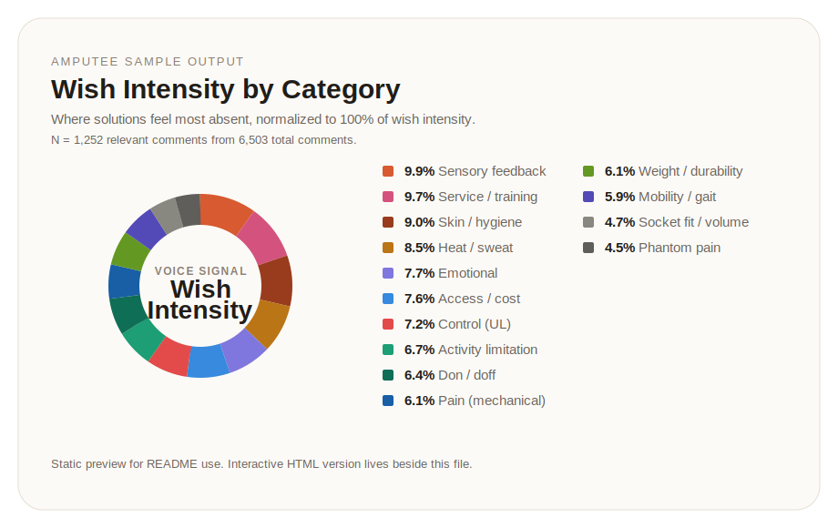

# unheard-buzz 🐝

Unheard-Buzz is an agent-first social listening toolkit for mining unmet needs from public online conversations.

The idea is simple:

- 🧠 the LLM handles planning, interviewing, and orchestration
- 🖥️ your local machine handles API calls, retries, checkpoints, files, and long-running work

That split matters. Chat-only environments are often weak at filesystem access, internet access, long jobs, and recovery after partial failures. This repo is designed to run on your own machine so the agent can stay conversational while the actual collection and reporting happen locally.

## What this helps you do 🔍

Use it for questions like:

- 🦾 What do amputees actually complain about with prosthetics?
- ⚡ What do EV drivers dislike about public charging?
- 🐾 What frustrates pet owners about tele-vet services?
- 🎮 What unmet needs show up in indie game publishing communities?

You define a topic, keywords, platforms, and category schema in `instruction.yaml`, and the pipeline:

1. 📥 collects posts across platforms
2. 🔄 normalizes them into a shared `SocialPost` model
3. 🧹 filters low-signal and near-duplicate content
4. 🎯 scores relevance and category fit
5. 📝 generates report-ready outputs

## Before you start 🛠️

This repo works best on a local Mac terminal.

You should have:

- 🔧 Git
- 🐍 Python 3.9+
- 💻 a terminal app
- 🤖 optionally Claude Code or Codex if you want the repo to be operated conversationally

If Git is missing on macOS, run:

```bash
xcode-select --install
```

If Python 3 is missing and you use Homebrew:

```bash
brew install python
```

## Clone it locally on macOS 💻

```bash
git clone https://github.com/myunghyunj/unheard-buzz.git
cd unheard-buzz
python3 -m pip install -r requirements.txt
cp .env.example .env
cp instruction_template.yaml instruction.yaml
```

At this point the repo is ready for configuration.

## Agent files vs other docs 📂

The root intentionally keeps only the files that agents auto-discover:

- `README.md` for humans
- `AGENTS.md` for Codex and similar repo-aware agents
- `CLAUDE.md` for Claude Code and similar chat-first agents

Those files stay at the repo root on purpose.

Other docs are grouped separately:

- `docs/ARCHITECTURE.md` for deep technical reference
- `.github/CONTRIBUTING.md` for contribution workflow
- `.github/SECURITY.md` for the security policy
- `.github/CODE_OF_CONDUCT.md` for community expectations

## If you want Claude Code or Codex to drive the workflow 🤖

### Claude Code

```bash
claude
```

Then tell Claude what you want to research.

This repo already includes `CLAUDE.md`, so Claude has project instructions available immediately.

If your usual workflow includes `/init`, you can still run it, but it is optional here because the runtime instruction file already exists.

### Codex

```bash
codex
```

Then tell Codex what you want to research. **cf. I prefer using Codex.**

This repo already includes `AGENTS.md`, so Codex can pick up the repo instructions without extra setup.

## What to tell the agent 💬

You do not need to prebuild everything manually. A good starting prompt is enough.

Examples:

- `I want to understand what amputees complain about with prosthetics. Start with YouTube, Reddit, and Google Trends.`
- `I want to research EV charging pain points in the US. Help me generate instruction.yaml and tell me which API keys I need.`
- `I want to look for tele-vet complaints. Use Reddit and YouTube first, and keep the categories simple for the first run.`

Good prompts usually include:

- 🎯 what market or pain point you want to investigate
- 🌍 which geography matters, if any
- 📡 which platforms you want to search
- 🔑 whether you already have API keys
- 🗂️ whether you want the agent to generate categories for you

## API keys: what you need and where to get them 🔑

### Required for YouTube collection

Environment variable:

- `YOUTUBE_API_KEY`

Where to get it:

- Google Cloud Console credentials page: [console.cloud.google.com/apis/credentials](https://console.cloud.google.com/apis/credentials)
- YouTube Data API v3 library page: [console.cloud.google.com/apis/library/youtube.googleapis.com](https://console.cloud.google.com/apis/library/youtube.googleapis.com)

Typical steps:

1. Create or select a Google Cloud project
2. Enable YouTube Data API v3
3. Create an API key
4. Paste it into `.env`

Example:

```bash
YOUTUBE_API_KEY=your_key_here
```

### Optional for Google Timeseries Insights anomaly detection

Environment variables:

- `GOOGLE_CLOUD_API_KEY`
- `GOOGLE_CLOUD_PROJECT`

Where to get it:

- Google Cloud Console: [console.cloud.google.com](https://console.cloud.google.com)
- Credentials page: [console.cloud.google.com/apis/credentials](https://console.cloud.google.com/apis/credentials)

This enables the optional post-collection anomaly step.

Example:

```bash
GOOGLE_CLOUD_API_KEY=your_google_cloud_key
GOOGLE_CLOUD_PROJECT=your-project-id
```

### Optional for Twitter/X 🐦

Environment variable:

- `TWITTER_BEARER_TOKEN`

Where to get it:

- X Developer portal: [developer.x.com](https://developer.x.com)
- Developer portal dashboard: [developer.x.com/en/portal/dashboard](https://developer.x.com/en/portal/dashboard)

Example:

```bash
TWITTER_BEARER_TOKEN=your_bearer_token
```

### Optional for LinkedIn 💼

Environment variable:

- `LINKEDIN_ACCESS_TOKEN`

Where to get it:

- LinkedIn Developer products: [developer.linkedin.com/product-catalog](https://developer.linkedin.com/product-catalog)

In practice, LinkedIn is often easier to use via manual CSV export rather than a live API flow.

### No key needed 🆓

- Reddit collection
- Google Trends via pytrends

## Put the keys into `.env` 🔐

After you create the keys, open `.env` and paste what you have.

Example:

```bash
YOUTUBE_API_KEY=your_key_here
TWITTER_BEARER_TOKEN=
LINKEDIN_ACCESS_TOKEN=
GOOGLE_CLOUD_API_KEY=
GOOGLE_CLOUD_PROJECT=
```

You can leave optional ones blank.

## First run options 🚀

### Option 1: Let the agent interview you and create `instruction.yaml` 🤖

Best if you are using Claude Code or Codex.

Start the agent inside the repo and say something like:

`I want to research EV charging pain points. Please interview me, generate instruction.yaml, check .env expectations, and prepare a dry run.`

### Option 2: Try the repo immediately with an example ⚡

```bash
python3 tools/run.py --instruction examples/amputee.yaml --dry-run
```

If that looks good, run the real pipeline:

```bash
python3 tools/run.py --instruction examples/amputee.yaml
```

### Option 3: Manual custom setup ✏️

Edit `instruction.yaml`, then run:

```bash
python3 tools/run.py --instruction instruction.yaml --dry-run
python3 tools/run.py --instruction instruction.yaml
```

## Useful controls in `instruction.yaml` ⚙️

These settings matter a lot in practice:

- `analysis.min_comment_words`
- `analysis.language_allowlist`
- `analysis.dedup_normalized_text`
- `analysis.dedup_min_chars`
- `analysis.include_irrelevant_in_stats`
- `analysis.segments`
- `reporting.quote_count`
- `reporting.max_cooccurrence_pairs`

They help keep the workflow practical on real, noisy internet data.

## How posts are scored 📊

Scoring runs in two stages.

**Stage 1 — Collector score** 🔎 (at collection time, per platform)

Filters noise before any expensive analysis runs.

| Component | Rule | Max contribution |
|-----------|------|-----------------|
| Keyword hits | +1.5 per relevance keyword found in text | unbounded |
| Length | +1.0 if 40–400 normalized characters | 1.0 |
| Engagement | likes ÷ 10, capped | 5.0 |
| Post type | +1.0 if top-level post, +0.5 if reply | 1.0 |

**Stage 2 — Final rank score** 🏆 (at analysis time, shared across platforms)

Determines which posts surface in reports and excerpts.

| Component | Weight | What it measures |
|-----------|-------:|-----------------|
| Relevance score | 40% | keyword density against the full relevance list |
| Collector score | 35% | signal quality from Stage 1, normalized to 0–1 |
| Category score | 25% | strength of match against the best-fitting complaint category |
| Wish bonus | +0.15 flat | post contains wish/want/need/hope language |
| Engagement bonus | +up to 0.25 | like count ÷ 50, capped |

**Example** 💡

Post: *"My socket hurts after an hour — the suction keeps failing and I sweat so much it stops gripping."*

| Stage | Calculation | Score |
|-------|-------------|------:|
| Keyword hits (socket, suction, sweat) | 3 × 1.5 | 4.5 |
| Length bonus | within 40–400 chars | +1.0 |
| Engagement | 8 likes ÷ 10 | +0.8 |
| Post type | top-level | +1.0 |
| **Collector score** | | **7.3 / 10** |
| Relevance (0.40) | 3 hits ÷ 3 cap = 1.0 | 0.40 |
| Collector norm (0.35) | 7.3 ÷ 8 = 0.91 | 0.32 |
| Category SF (0.25) | 2 keyword hits in socket category | 0.17 |
| Wish bonus | no wish word present | 0.00 |
| Engagement bonus | 8 likes ÷ 50 | +0.16 |
| **Final rank score** | | **0.95** |

The wish bonus is intentionally flat — a zero-like post saying *"I wish I could feel what I'm gripping"* carries the same wish signal as a viral one.

## Outputs 📁

Typical outputs include:

- 📄 `trend_report.md`
- 📄 `summary_report.md`
- 📄 `quotable_excerpts.md`
- 📊 `all_posts.csv`
- 📊 `coded_posts.csv`
- 📊 `coded_comments.csv`
- 📊 `source_registry.csv`
- 📊 `channel_registry.csv` when YouTube collection runs
- 📊 `video_registry.csv` when YouTube collection runs
- 📊 `summary_stats.json`
- 📄 `validation_report.md`
- 📄 `tsi_anomaly_report.md` when the optional TSI step is enabled

These are designed to be easy to inspect, share, and move into research notes, client memos, or slides.

## Sample visualization 📈

Below is a static preview from the amputee sample-output bundle.
The interactive HTML version was visualized via Claude after the pipeline results were retrieved.



- A static preview is embedded above for quick scanning in the repo.
- The sample bundle also includes an interactive HTML version of the same chart.

## Example topics 🗂️

Ready-made instruction examples live in `examples/`.

Included examples cover:

- 🦾 amputee prosthetic unmet needs
- ⚡ EV charging pain points
- ♿ wheelchair accessibility
- 🏠 smart home privacy
- 🐾 pet telehealth
- 🎮 indie game publishing
- 🐝 urban beekeeping
- 🍞 sourdough baking

There is also a packaged sample-output bundle for the amputee brief, including reports, coded exports, registries, checkpoints, and a standalone visualization.

## Operational notes ⚠️

This workflow can be API- and rate-limit-heavy, especially on YouTube and Twitter/X.

Start narrow:

- 🎯 use smaller query sets
- 📉 use smaller collection quotas
- 🧪 run `--dry-run` first
- 💾 use checkpoint/resume when iterating

That usually gives better signal and makes debugging easier.

## Current strengths ✅

Unheard-Buzz is strongest today as a configurable workflow engine for unmet-need discovery.

It already does a few things well:

- 🔄 cross-platform normalization into a shared `SocialPost` model
- 🧹 collector-level filtering and deduplication
- ⚙️ configurable category and segment schemas
- 🎯 relevance and category scoring
- 📝 report generation for summaries, quotes, stats, and coded exports
- 🗂️ source and YouTube registry generation for auditability
- 💾 checkpoint-aware execution

It is especially useful when the value comes from real user language, not polished survey answers.

## What it is not yet 🚧

This repository is not yet a full semantic intelligence stack.

That means:

- 🌐 multilingual understanding is still partial
- 🔤 language handling is improving but not fully production-grade
- 📊 ranking is better than before, but still heuristic-heavy
- 🔌 some platform adapters are stronger than others
- ✏️ the system still depends heavily on good query design and category design

## Project structure 🗂️

```text
unheard-buzz/
├── README.md
├── AGENTS.md
├── CLAUDE.md
├── docs/
│   ├── README.md
│   └── ARCHITECTURE.md
├── .github/
│   ├── CONTRIBUTING.md
│   ├── SECURITY.md
│   ├── CODE_OF_CONDUCT.md
│   └── workflows/
├── instruction_template.yaml
├── examples/
├── tools/
├── tests/
├── input/
└── output/
```

## Development checks 🧪

```bash
python3 -m py_compile tools/*.py
python3 -m unittest discover -s tests -v
python3 tools/run.py --instruction examples/amputee.yaml --dry-run
```

## Future plans 🌍

We are expanding toward broader regional and language coverage across communities in:

- 🇰🇷 Korea
- 🇯🇵 Japan
- 🇨🇳 China
- 🇷🇺 Russia
- 🇺🇸 the United States
- 🇪🇺 Europe

The important distinction is this:

- ✅ current multilingual support exists
- 🚧 production-grade multilingual coverage is still a roadmap item

## One-line summary 💡

Unheard-Buzz is a human-LLM interfacing tool-box.

It is an agent-driven research workflow that uses the user's own machine to do the internet-facing work that chat-only environments often cannot do well.
